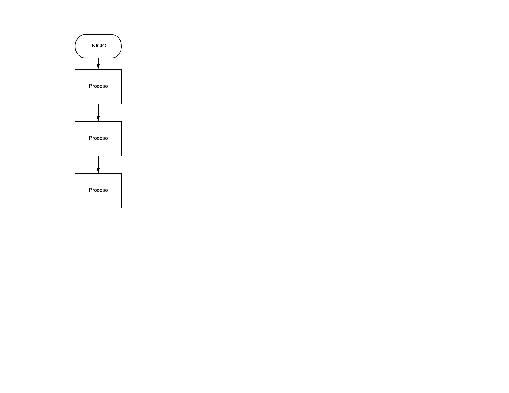

# SCOREKEEPER

### Descripción:

Imagina que estás jugando un juego con algunas amigas y quieres ir registrando el puntaje de cada una. Crea un object llamado scores donde los keys o propiedades son los nombres de tus amigas, y los valores serán los puntajes (todos empiezan con 0).

Escribe una función que toma dos argumentos, el nombre de tu amiga y la cantidad de puntos nuevos que ha obtenido, y que actualice los puntos de la jugadora en el object scores. También escribe una función que imprima en la consola el total de los puntos.

## Pseudocódigo
### Descripción
En esta parte se describe la funcionalidad del proyecto descrito en pasos.

 1. Definir en el objeto _SCORES_ en el cual se almacenara toda la data.

 2. Crear los elementos jugadores que se almacenaran como *keys* en el objeto _SCORES_.

 3. Agregar el puntaje de cada jugador.

 4. Imprimir toda la data que se encuentra almacenada en el objeto _SCORES_.

## Diagrama de flujo

Lorem ipsum dolor sit amet, consectetur adipisicing elit, sed do eiusmod tempor incididunt ut labore et dolore magna aliqua. Ut enim ad minim veniam, quis nostrud exercitation ullamco laboris nisi ut aliquip ex ea commodo consequat. Duis aute irure dolor in reprehenderit in voluptate velit esse cillum dolore eu fugiat nulla pariatur. Excepteur sint occaecat cupidatat non proident, sunt in culpa qui officia deserunt mollit anim id est laborum.

